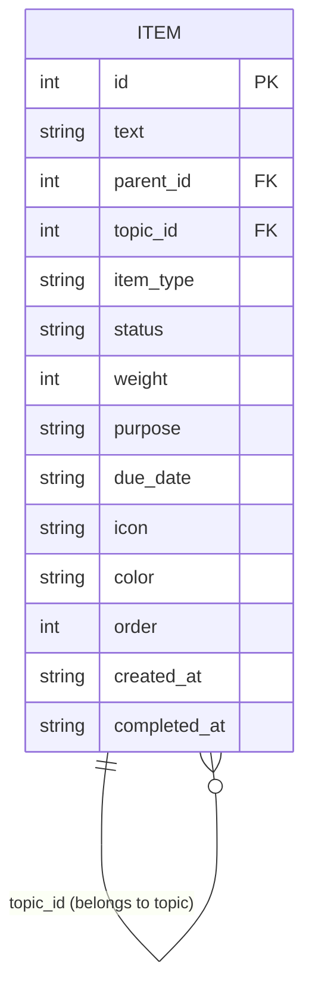
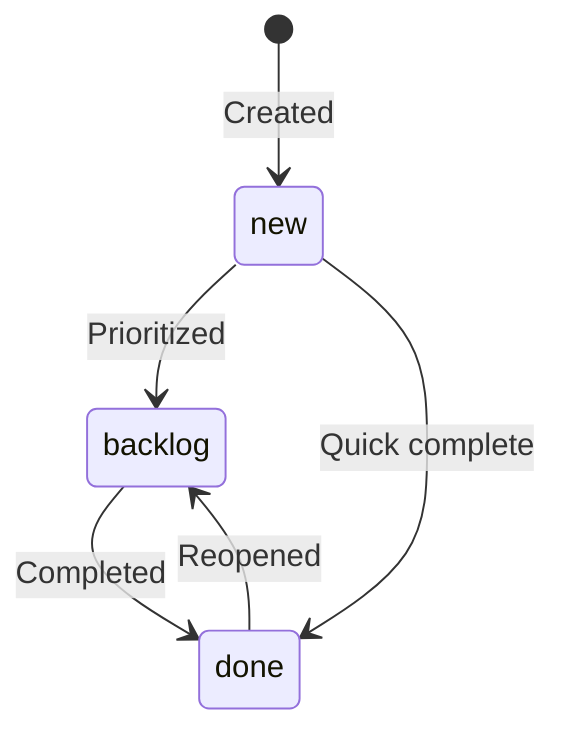

# Data Model

**Last Updated:** January 16, 2026
**Status:** Draft v0.1

---

## Overview

This document defines the data structures for the Management System. The core principle is **"Everything is an item"**—topics, projects, tasks, ideas, and reminders share a unified structure but differ in behavior based on type and hierarchy position.

---

## Core Concepts

### Item Lifecycle

Items begin as **Ideas** (quick capture with minimal information) and are **promoted** to other types as they mature:

```
┌─────────────────────────────────────────────────────┐
│                      IDEA                           │
│            (raw capture, minimal info)              │
└─────────────────────┬───────────────────────────────┘
                      │ promote
        ┌─────────────┼─────────────┬─────────────┐
        ▼             ▼             ▼             ▼
    ┌───────┐    ┌─────────┐   ┌────────┐   ┌──────────┐
    │ TOPIC │    │ PROJECT │   │  TASK  │   │ REMINDER │
    └───────┘    └─────────┘   └────────┘   └──────────┘
```

### Containment Hierarchy

Items can contain other items, creating a hierarchy:

```
Universe (implicit root)
  └── Topic (ongoing, never "done")
        └── Project (finite, has end state)
              └── Task (atomic, completable)
                    └── Subtask (nested task)
```

**Key insight:** Hierarchy defines *containment* (what holds what), while promotion defines *lifecycle* (what an item becomes).

---

## Entity Definitions

### Item (Primary Entity)

The unified `items` table stores all entity types.

| Attribute | Type | Required | Description |
|-----------|------|----------|-------------|
| `id` | INTEGER | Yes | Primary key, auto-increment |
| `text` | TEXT | Yes | Display text / title |
| `parent_id` | INTEGER | No | FK to parent item (NULL = root level) |
| `topic_id` | INTEGER | No | Denormalized FK to root topic (NULL for topics themselves) |
| `item_type` | TEXT | Yes | One of: `idea`, `topic`, `project`, `task`, `reminder` |
| `status` | TEXT | Yes | One of: `new`, `backlog`, `done` |
| `weight` | INTEGER | Yes | Priority 1-10 (default 5) |
| `purpose` | TEXT | Conditional | **Required for topics**, optional otherwise |
| `due_date` | TEXT | No | ISO date string |
| `icon` | TEXT | No | Icon filename (e.g., "Work.ICO") |
| `color` | TEXT | No | Hex color for display |
| `order` | INTEGER | Yes | Sort order within parent (default 0) |
| `created_at` | TEXT | Yes | ISO timestamp |
| `completed_at` | TEXT | No | ISO timestamp when status → done |

#### Legacy Fields (Migration Compatibility)

| Attribute | Type | Description |
|-----------|------|-------------|
| `ranking` | INTEGER | 1-5 scale (maps to weight) |
| `difficulty` | TEXT | easy/medium/hard |

---

## Item Types

### Topic

**Definition:** An ongoing area of focus that is never "done."

| Property | Value |
|----------|-------|
| Can have children | Yes (projects, tasks, ideas) |
| Can be completed | No |
| Requires purpose | **Yes** |
| Examples | "Photography", "Health", "Career" |

**Behavior:**
- Always visible in navigation
- Groups related projects and tasks
- Weight determines dashboard sort order

---

### Project

**Definition:** A finite endeavor with a clear end state.

| Property | Value |
|----------|-------|
| Can have children | Yes (tasks, subtasks) |
| Can be completed | Yes |
| Requires purpose | No (goal implied) |
| Examples | "Build portfolio site", "Plan holiday" |

**Behavior:**
- Lives under a topic
- Progress trackable via child completion
- Can have due date

---

### Task

**Definition:** An atomic, completable unit of work.

| Property | Value |
|----------|-------|
| Can have children | Yes (subtasks, **max 3**) |
| Can be completed | Yes |
| Requires purpose | No |
| Examples | "Choose domain name", "Call dentist" |

**Behavior:**
- Simplest actionable item
- Can have up to 3 subtasks (1 level deep only)
- When 4th subtask attempted → prompt to convert to Project
- Completing a task auto-completes all subtasks
- Status: new → backlog → done

**Subtask Limits:**
- Maximum 3 subtasks per task
- Subtasks cannot have their own children (1 level only)
- Exceeding limit prompts: "Convert to Project?"

---

### Idea

**Definition:** A quick capture requiring minimal information.

| Property | Value |
|----------|-------|
| Can have children | No (until promoted) |
| Can be completed | No (must promote or discard) |
| Requires purpose | No |
| Examples | "Learn Rust?", "New app concept" |

**Behavior:**
- Entry point for all items
- Lives in Ideas list until promoted
- Promotion = assign type + parent

---

### Reminder

**Definition:** A time-sensitive prompt.

| Property | Value |
|----------|-------|
| Can have children | No |
| Can be completed | Yes (dismissed) |
| Requires purpose | No |
| Examples | "Renew passport", "Follow up with client" |

**Behavior:**
- Requires due_date
- Surfaces in time-based views
- Can live under any parent

---

## Relationships

### Entity-Relationship Diagram



### Relationship Rules

1. **parent_id** - Direct parent in hierarchy
   - Topics: `parent_id = NULL`
   - Projects: `parent_id = topic_id`
   - Tasks: `parent_id = project_id OR topic_id`
   - Subtasks: `parent_id = task_id`

2. **topic_id** - Denormalized reference to root topic
   - Enables fast "get all items for topic" queries
   - Topics themselves: `topic_id = NULL`
   - All descendants: `topic_id = ancestor topic's id`

---

## Status Flow



| Status | Meaning |
|--------|---------|
| `new` | Just captured, not yet prioritized |
| `backlog` | Actively being worked / in queue |
| `done` | Completed or dismissed |

---

## Weight System

Weight (1-10) determines priority across the system:

| Weight | Meaning | Color (UI) |
|--------|---------|------------|
| 1-2 | Low priority / someday | Blue |
| 3-4 | Normal | Green |
| 5-6 | Important | Yellow |
| 7-8 | High priority | Orange |
| 9-10 | Critical / urgent | Red |

**Inheritance:** Child items don't inherit parent weight—each item has independent priority.

---

## Indexes

For query performance:

```sql
CREATE INDEX idx_items_parent ON items(parent_id);
CREATE INDEX idx_items_topic ON items(topic_id);
CREATE INDEX idx_items_type ON items(item_type);
CREATE INDEX idx_items_status ON items(status);
CREATE INDEX idx_items_topic_status ON items(topic_id, status);
```

---

## Migration Notes

### Legacy Tables

The system currently has two legacy tables that will be deprecated:

| Table | Maps To | Notes |
|-------|---------|-------|
| `topics` | items where `item_type = 'topic'` | id becomes text-based slug |
| `ideas` | items where `item_type = 'task'` | topic field → parent_id + topic_id |

### Migration Strategy

1. Keep legacy tables during transition
2. UI reads from legacy, writes to both
3. Once UI fully migrated, drop legacy tables

---

## Nesting Rules Summary

See `NESTING_RULES.md` for full details.

| Container | Can Contain | Limits |
|-----------|-------------|--------|
| Topic | Projects, Tasks, Ideas | Unlimited |
| Project | Tasks | Unlimited |
| Task | Subtasks | **Max 3, 1 level deep** |
| Subtask | Nothing | Leaf node |

**Completion cascade:** Completing a parent auto-completes all children.

---

## Open Questions

- [ ] Should `item_type` be extensible or fixed enum?
- [ ] How to handle recurring reminders?
- [ ] Archive status vs. deletion?

---

## Related Documents

- `TERMINOLOGY.md` - Official naming conventions
- `NESTING_RULES.md` - Subtask and hierarchy rules
- `ARCHITECTURE.md` - System design decisions
- `UI_MAPPING.md` - Data to UI component mapping

---

## Changelog

| Date | Change |
|------|--------|
| 2026-01-16 | Initial draft |
| 2026-01-16 | Added nesting rules (max 3 subtasks, 1 level, auto-complete cascade) |
